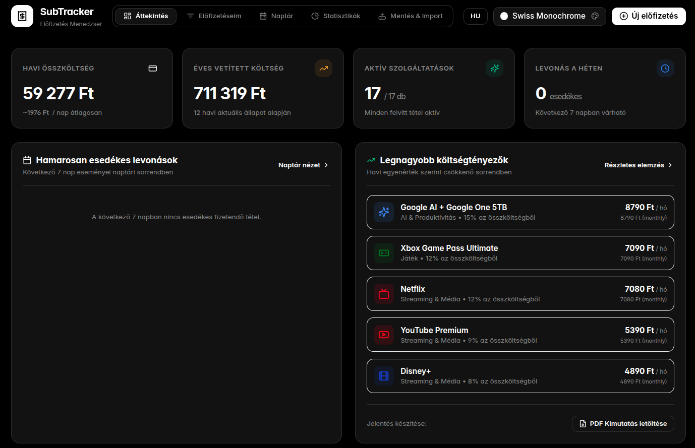

# SubTracker - Modern Előfizetés Kezelő Webalkalmazás

🌍 *[Read this in English](#subtracker---modern-subscription-manager-web-app)*


Egy prémium minőségű, letisztult, Docker konténerben futtatható webalkalmazás a különféle havi és éves előfizetések precíz követésére, naptári tervezésére, statisztikai elemzésére és adatmentésére.


<div align="center">
  
  <br/>
  <i>Irányítópult és havi költségvetés (Magyar nyelvű felület)</i>
</div>

---

## Főbb Funkciók

1. **Előfizetések Rugalmas Kezelése:**
   - **Katalógus választó:** 40+ előre konfigurált népszerű szolgáltatás (Netflix, YouTube Premium, Apple TV+, Google AI / Gemini, Spotify, ChatGPT Plus, Claude Pro, GitHub Copilot, Disney+, Max, Adobe, Canva, stb.) logóval, színnel és alapértelmezett kategóriával.
   - **Kézi rögzítés és testreszabás:** Összeg, deviza (HUF, EUR, USD, GBP), számlázási ciklus (havi, éves, negyedéves, heti), következő esedékesség, fizetési mód (bankkártya, PayPal), közvetlen weboldal URL és egyedi jegyzetek.
   - **Próbaidőszak követés (Trial Tracker):** Riasztás a lejárat előtt álló ingyenes próbaidőszakokról a nem kívánt megújulás megelőzésére.
   - **Szüneteltetés / Aktiválás:** 1 kattintásos státuszváltás; az inaktív szolgáltatások azonnal kikerülnek a havi kiadási kalkulációból.

2. **Pénzügyi Dashboard & Havi Költségvetés:**
   - Havi összesített kiadás automatikus deviza-átszámítással (HUF bázis).
   - Napi átlagos költés és 12 hónapra vetített éves becslés.
   - Figyelmeztető értesítések a következő 7 napban esedékes levonásokról.

3. **Interaktív Naptár Nézet:**
   - Magyar formátumú havi naptárrács esedékességi pontokkal és színes szolgáltatás-címkékkel.
   - Hónap- és évváltó navigáció.
   - Napi részletező panel: adott napra eső összes levonás összege és gyorsszerkesztési lehetősége.

4. **Statisztikák, Grafikonok és Pénzügyi Elemzések:**
   - **Kördiagram (Pie Chart):** Kiadások megoszlása kategóriák szerint arányokkal és összegekkel.
   - **Oszlopdiagram (Bar Chart):** A legnagyobb havi költségtényezők közvetlen összehasonlítása.
   - **Fizetési módok bontása:** Melyik bankkártyáról vagy számláról mekkora terhelés várható havonta.
   - **Költségoptimalizálási tanácsok:** Éves fizetés, családi csomagok és felülvizsgálati szempontok.

5. **Professzionális PDF Kimutatás Letöltése:**
   - Egyetlen kattintással letölthető, vektoros, nyomtatható formátumú A4 pénzügyi riport.
   - Tartalmazza a fő mutatószámokat (KPI), kategóriabontást és a teljes előfizetési listát.

6. **Biztonsági Mentés & Visszaállítás (Backup & Restore):**
   - **JSON export:** Teljes adatbázis-mentés időbélyeggel és konfigurációkkal.
   - **CSV export:** Táblázatkezelőkkel (Excel, Google Sheets) kompatibilis formátum.
   - **Visszatöltés:** JSON fájl importálása **Összefésülés (Merge)** vagy **Teljes felülírás (Replace)** módban.

---

## 10 Beépített Dizájn Téma

Az alkalmazás szigorúan kerüli az AI-neon és túlzó hiper-telített stílusokat; kizárólag professzionális, kontrasztos, letisztult palettákat használ:

1. **Obsidian Slate (Alapértelmezett):** Mély grafitszürke háttér hűvös kék akcentusokkal (Sötét).
2. **Minimal Porcelain:** Tiszta hófehér, elegáns fekete és királykék tipográfiával (Világos).
3. **Nord Frost:** Sarkvidéki kékesszürke és fagyos jégkék árnyalatok (Sötét).
4. **Tokyo Night:** Mélykék éjszakai háttér diszkrét levendula kiemeléssel (Sötét).
5. **Catppuccin Mocha:** Bársonyos sötét tónusok, lágy meleg lila és kék pasztellekkel (Sötét).
6. **Emerald Forest:** Mély erdőzöld pala háttér, elegáns smaragd akcentussal (Sötét).
7. **Swiss Monochrome:** Szigorú fekete-fehér és neutrális szürke tipográfiai dizájn (Sötét).
8. **Solarized Dark:** Klasszikus sötét cián és zöldeskék háttér visszafogott borostyánnal (Sötét).
9. **Warm Sand & Paper:** Meleg pergamen háttér terrakotta és diófa részletekkel (Világos).
10. **Midnight Indigo:** Mély indigókék fintech esztétika, modern kobaltkék fókusszal (Sötét).

*A témák azonnal, oldalújratöltés nélkül válthatók a fejléc jobb felső részén található paletta gombbal, és a kiválasztott téma automatikusan mentésre kerül a böngészőben.*

---

## Futtatás Docker Konténerben

### 1. Indítás Docker Compose-zal (Ajánlott)

A mellékelt `docker-compose.yml` konfiguráció tartalmazza a perzisztens kötetkezelést (`subdata`), így az adatok a konténer újraindítása vagy frissítése után is megmaradnak.

```bash
docker compose up -d --build
```

Nyisd meg a böngészőben: `http://localhost:3000`

A konténer leállítása:
```bash
docker compose down
```

### 2. Indítás natív Docker parancsokkal

```bash
# Képfájl elkészítése
docker build -t subscription-manager .

# Konténer futtatása perzisztens adatkötettel
docker run -d \
  --name subscription-manager \
  -p 3000:3000 \
  -v subscription_data:/app/data \
  --restart unless-stopped \
  subscription-manager
```

---

## Futtatás Helyi Fejlesztői Környezetben (Node.js)

```bash
# Függőségek telepítése
npm install

# Fejlesztői szerver indítása
npm run dev

# Vagy produkciós build és indítás
npm run build
npm run start
```

Az alkalmazás alapértelmezetten a `http://localhost:3000` címen érhető el, és az adatbázist a helyi `./data/subscriptions.db` fájlban tárolja.

---

## Technológiai Verem

- **Keretrendszer:** Next.js 15 (App Router, Server Actions & Route Handlers) + React 19 + TypeScript
- **Stílus és Témák:** Tailwind CSS, Lucide React ikonok, CSS Custom Properties
- **Adattárolás:** SQLite WAL-módban (`better-sqlite3`), zéró külső adatbázis-függőség
- **Grafikonok:** Recharts
- **Riport generálás:** jsPDF + jsPDF-AutoTable
- **Konténer:** Multi-stage Node.js 22 Alpine minimális memórialábnyommal (~150MB)

---
---

# SubTracker - Modern Subscription Manager Web App

A premium-quality, clean web application deployable in a Docker container for the precise tracking, calendar planning, statistical analysis, and data backup of various monthly and annual subscriptions.


<div align="center">
  
  <br/>
  <i>Dashboard and Monthly Budget (English interface)</i>
</div>

---

## Key Features

1. **Flexible Subscription Management:**
   - **Catalog picker:** 40+ pre-configured popular services (Netflix, YouTube Premium, Apple TV+, Google AI / Gemini, Spotify, ChatGPT Plus, Claude Pro, GitHub Copilot, Disney+, Max, Adobe, Canva, etc.) with logos, colors, and default categories.
   - **Manual entry and customization:** Amount, currency (HUF, EUR, USD, GBP), billing cycle (monthly, yearly, quarterly, weekly), next due date, payment method (credit card, PayPal), direct website URL, and custom notes.
   - **Trial Tracker:** Alerts for upcoming free trial expirations to prevent unwanted renewals.
   - **Pause / Activate:** 1-click status toggle; inactive services are immediately excluded from monthly expense calculations.

2. **Financial Dashboard & Monthly Budget:**
   - Total monthly expenses with automatic currency conversion (HUF base).
   - Average daily spending and projected 12-month annual cost.
   - Warning notifications for deductions due in the next 7 days.

3. **Interactive Calendar View:**
   - Monthly calendar grid with due date markers and colored service labels.
   - Month and year navigation.
   - Daily details panel: total deduction amount for the selected day with quick-edit options.

4. **Statistics, Charts, and Financial Analytics:**
   - **Pie Chart:** Expense distribution by categories with ratios and amounts, expandable to see individual subscriptions.
   - **Bar Chart:** Direct comparison of the largest monthly expense factors.
   - **Payment method breakdown:** Expected monthly charges per credit card or account.
   - **Yearly breakdown per service:** Detailed list of how much each subscription costs over a full year.
   - **Cost optimization tips:** Annual billing, family plans, and review criteria.

5. **Professional PDF Report Download:**
   - 1-click download of a vector-based, printable A4 financial report.
   - Includes key performance indicators (KPIs), category breakdown, and the complete subscription list.

6. **Backup & Restore:**
   - **JSON export:** Full database backup with timestamps and configurations.
   - **CSV export:** Spreadsheet-compatible format (Excel, Google Sheets).
   - **Restore:** Import JSON files in **Merge** or **Replace** mode.

---

## 10 Built-in Design Themes

The application strictly avoids AI-neon and overly hyper-saturated styles; it uses only professional, high-contrast, clean palettes:

1. **Obsidian Slate (Default):** Deep graphite gray background with cool blue accents (Dark).
2. **Minimal Porcelain:** Clean snow-white with elegant black and royal blue typography (Light).
3. **Nord Frost:** Arctic blue-gray and frosty ice blue shades (Dark).
4. **Tokyo Night:** Deep blue night background with discreet lavender highlights (Dark).
5. **Catppuccin Mocha:** Velvety dark tones with soft warm purple and blue pastels (Dark).
6. **Emerald Forest:** Deep forest green slate background with elegant emerald accents (Dark).
7. **Swiss Monochrome:** Strict black-and-white and neutral gray typographic design (Dark).
8. **Solarized Dark:** Classic dark cyan and teal background with muted amber (Dark).
9. **Warm Sand & Paper:** Warm parchment background with terracotta and walnut details (Light).
10. **Midnight Indigo:** Deep indigo fintech aesthetic with a modern cobalt blue focus (Dark).

*Themes can be switched instantly without reloading via the palette button in the top right corner, and the selected theme is automatically saved in the browser.*

---

## Running in a Docker Container

### 1. Start with Docker Compose (Recommended)

The provided `docker-compose.yml` configuration includes persistent volume management (`subdata`), so your data is preserved even after restarting or updating the container.

```bash
docker compose up -d --build
```

Open in your browser: `http://localhost:3000`

To stop the container:
```bash
docker compose down
```

### 2. Start with Native Docker Commands

```bash
# Build the image
docker build -t subscription-manager .

# Run the container with a persistent data volume
docker run -d \
  --name subscription-manager \
  -p 3000:3000 \
  -v subscription_data:/app/data \
  --restart unless-stopped \
  subscription-manager
```

---

## Running in a Local Development Environment (Node.js)

```bash
# Install dependencies
npm install

# Start development server
npm run dev

# Or build for production and start
npm run build
npm run start
```

The application is available by default at `http://localhost:3000`, and the database is stored in the local `./data/subscriptions.db` file.

---

## Technology Stack

- **Framework:** Next.js 15 (App Router, Server Actions & Route Handlers) + React 19 + TypeScript
- **Styling and Themes:** Tailwind CSS, Lucide React icons, CSS Custom Properties
- **Data Storage:** SQLite in WAL mode (\`better-sqlite3\`), zero external database dependencies
- **Charts:** Recharts
- **Report Generation:** jsPDF + jsPDF-AutoTable
- **Container:** Multi-stage Node.js 22 Alpine with a minimal memory footprint (~150MB)
